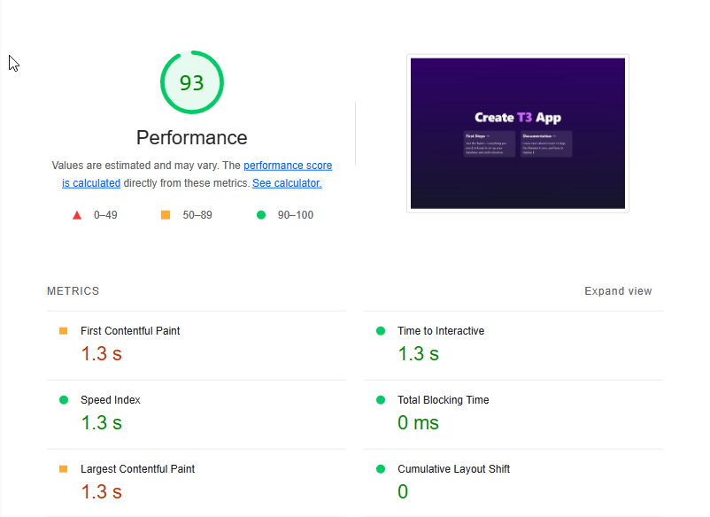

# .Net + Webpack (Div Replacement)
## Getting started
- Move into the backend-server\Backend.Graph\src directory
- Run `yarn; yarn build;`
- Move into the backend-server/Backend.Graph directory
- Run `dotnet run`

## Results
- [Lighthouse with client side meta tags](./resources/lighthouse_metatags.json)

- [Lighthouse without client side meta tags](./resources/lighthouse_nometatags.json)

## Pros
- One application stack to maintain (C#)
- Server side logic within Razor Pages is very minimal
- Can easily use C# backend features
    - Authentication / Authorization

## Cons
- Webpack 🤦‍♂️
- Development environment is far from complete and usable
    - This demo only showcased one bundle being created for one razor page.
    - In a scenario with multiple razor pages all having their own bundle (chunk) webpack will need to be further configured.
    - No HMR, hot module replacement hasn't been setup because webpack isn't a familiar language and time was spent even getting this simple demo started.
- "Flicker"
    - I call this effect the flicker, it's the result of React taking over the page and replacing the div content with Reacts generated content. In this demo the lighthouse performance panel provides good insight into why this happens. It took 1.3 seconds to have content painted into the browser view. In this case 1.3 seconds might be acceptable but this component is far from complex and renders very simple UI. I suspect that these numbers would become further degraded if the component was larger and more interactive.
- Webpack didn't produce a nice bundle
    - This I am sure could be fixed with further knowledge of webpack and its config. As a result of how the bundle was created all the JS and CSS is in one file which must be loaded over the wire before content can be displayed.

## Additional context
- I provided a MetaTag component using an external library that helps to place meta tags onto the dom in a similar way to NextJs. In doing so the lighthouse scores were improved because of the existence of the tags. However I also provided scores without this MetaTag in place because as the tags are placed client side, they're not present until the first render pass by React. Most SEO scrapers won't load JS and therefore the tags won't be present.
    - An additional work around would be to place the meta tags inside of the Razor Page's cshtml file above the react container. The downside here is that content is now spread between the Razor page and the React components.
- The development workflow becomes more manual (_in comparison to other approaches_) to get new pages up and running.
    - First a new webpack bundle must be setup. Multiple output bundles or chunks is possible in webpack just not implemented in this demo.
    - Secondly a new razor page must get created.
    - Lastly, the React work must be done inside of this newly created bundle.
    - Further file jumping might be required depending on additional features such as server side data or meta tags.

## Overall option
This method of React in .Net which I call div replacement is by the far the simplest to get started (once you figure out webpack). However as a result of this all of the more advanced features and improvements are feature locked behind your knowledge of webpack. This approach results in the least flexible of the options as well as lower lighthouse scores. *Server side props* are possible by providing them within the Razor pages but more manual work is then required to pass those props into React itself. This approach is fine for internal facing content or webpages that aren't extremely focussed on SEO scoring. As well more time would need to be invested to improve the development experience via webpack modifications.

_All views presented here are my own and not presentative of my company or work._