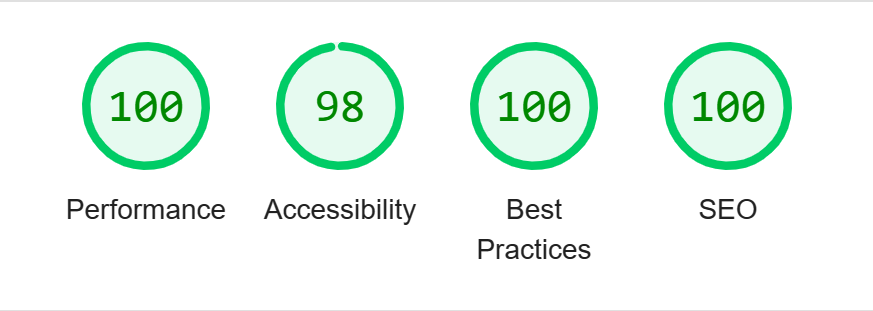

# NextJS + .Net with YARP
## Getting started
- Move into the backend-server/Backend.Graph directory
- Run `dotnet run`
- In another console move into the ui-server directory
- Run `yarn; yarn build; yarn start;` It's important that NextJs isn't running in dev mode for this demo as that produces much lower scores
- Launch an incognito browser and navigate to the URL hosting the .Net project to get started

## Results
- [Lighthouse](./resources/lighthouse_scores.json)

## Pros
- Microservice approach allows for development to happen in either platform and deployment / hosting strategies can vary and adapt
- Responsibilities are split between the teams that know their platforms best
    - C# developers can build the backend in their project
    - Frontend / React developers can build the UI in their project
- Performance and resources can be split to the service that needs them the most
    - In a true microservice approach more backend/frontend sites can be spun up independent of each other to meet demand
- Statically generated content with Next
- Flexibility of Next allows the front end to adapt to different scenarios without needing to change anything
    - This demo is currently using a statically generated component. However it would be very easy to switch to an [Incremental Static Regeneration (ISR)](https://nextjs.org/docs/basic-features/data-fetching/incremental-static-regeneration) or [Sever Side Render (SSR)](https://nextjs.org/docs/basic-features/data-fetching/get-server-side-props) approach without changing any of the core project setup.
- Local development
    - A pro of any tech stack is how easy it is to work with and develop in. Next out of the box provides a smooth development flow with everything already setup like HMR and other local considerations. The other approaches can offer similar features but at the cost of time to set them up.
    - Integration into the project is simple, creating new routes inside of the NextJs application will enable them in the presentation application via YARP without code changes or configuration changes.

## Cons
- Microservices create more chatter between projects resulting in a chatty network
- Multiple applications creates more points of failure to monitor for
- YARP currently is in preview and therefore can change which may alter this approach in the future
    - YARP in itself is a learning curve that is mostly a set and forget approach but will still require some maintenance
- Future considerations outside of this demo will need to be taken into account for production environments
    - YARP with authentication/authorization if needed
    - Logging solutions that work for both platforms
    - Failure/Fallback routing within YARP in the event the UI server is down

## Overall option
This approach allows for the most flexibility in terms of the future of web technologies. By splitting the concerns of the application into smaller chunks the application can change and grow to meet new needs without refactoring the entire thing. Next features can be implemented to solve front end problems and .Net features can be implemented to solve backend problems. Merging these two technologies allows for a great development experience as well as the ability to create a performant dynamic application for the end user.

## Other Comments and Concerns
- The component used for all these approaches is a fairly simple single page view. It was generated using create-t3-app with Tailwind integration. It is a very simple component and these scores could change with a much larger more complex UI. However, I believe the scores in this approach wouldn't be greatly degraded because of the nature of NextJS providing statically generated content at compile time.

_All views presented here are my own and not presentative of my company or work.